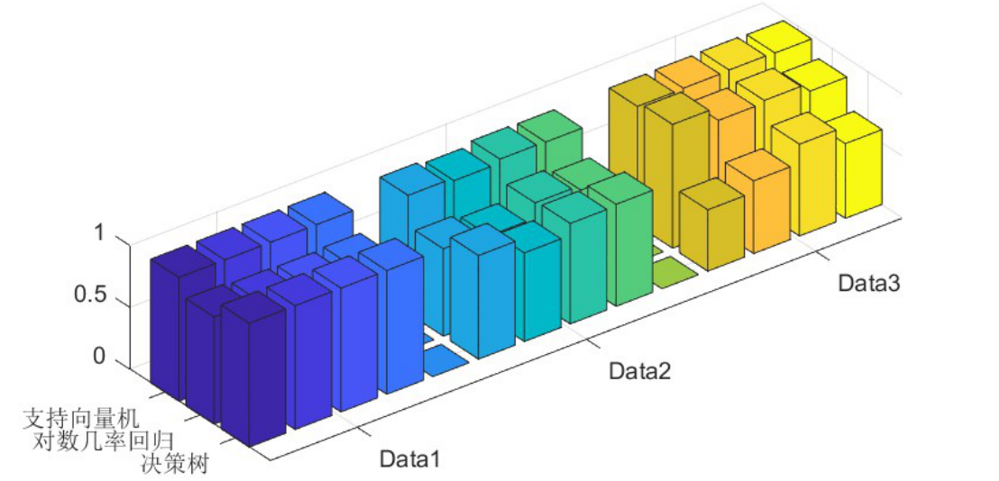
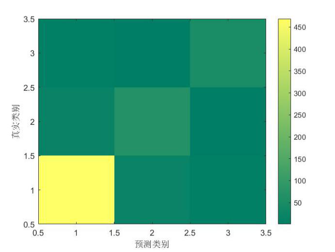

# 🎓 ML Capstone：多数据集分类模型对比与可复现实验（.mat 可配置）

## 项目亮点（Portfolio Highlights）
- **可复现**：不依赖仓库内置数据集；通过 CLI 参数指定 `.mat` 文件、变量 key、标签列位置即可运行
- **统一入口**：一个 `run.py` 跑完训练 / 调参 / 评估 / 落盘（图 + JSON + 汇总 CSV）
- **实现能力**：包含手写 **Logistic Regression（Newton/拟牛顿式更新，Hessian + `pinv`）**
- **实验规范**：SVM 调参使用训练集 CV，最终在 **held-out test** 上评估，避免数据泄漏
- **结果沉淀**：输出混淆矩阵热力图、决策树可视化、`metrics.json`、`summary.csv`

---

## 目录结构（What’s inside）
- `src/inspect_mat.py`：检查 `.mat` keys / shape，帮助确定 `--mat-key` 与 `--label-col`
- `src/data.py`：通用数据加载（支持 label 在 `first|last|index`）
- `src/run.py`：统一 CLI（选择模型、是否调参、随机种子、输出目录等）
- `src/logreg_newton_binary.py`：二分类 Logistic Regression（Newton-style）
- `src/logreg_ovo_multiclass.py`：多分类 Logistic Regression（OvO + 投票）
- `src/decision_tree_tuning.py`：决策树 CV 调参 + 测试集评估
- `src/svm_tuning.py`：SVM CV 调参 + 测试集评估（修复原脚本泄漏）
- `src/metrics.py` / `src/plots.py`：指标与可视化
- `tests/test_smoke.py`：合成数据 smoke tests（无 `.mat` 也能跑）

> 运行产物会写入 `reports/<run-id>/`，且 `reports/` 默认被 `.gitignore` 忽略（避免提交大量实验输出）。

---

## Quick Start（推荐流程）
### 1) 先检查你的 `.mat` 文件
```bash
python 04-ml-capstone/src/inspect_mat.py --mat-path your_dataset.mat
```

### 2) 运行一个模型（示例：SVM + 调参）
```bash
python 04-ml-capstone/src/run.py \
  --mat-path your_dataset.mat \
  --mat-key data \
  --label-col last \
  --model svm \
  --tune \
  --test-size 0.2 \
  --random-state 42
```

---

## 📊 结果展示（Portfolio Results）
### 跨数据集、跨模型整体对比
> 这张图用于快速展示：不同模型在 Data1 / Data2 / Data3 上的整体差异（作品集主图）。



### 多分类任务：混淆矩阵（示例）
> 用于展示类别间易混淆关系，帮助定位模型问题与数据难点。



### 二分类任务：Logistic Regression（Newton）混淆矩阵（示例）
> 我在该项目中手写实现了 Newton/拟牛顿式 Logistic Regression（二分类），并用混淆矩阵展示分类表现。


### Logistic Regression（Newton）表格结果（来自报告整理）
- CSV：[results/logreg_results.csv](results/logreg_results.csv)
- 内容：蘑菇数据集（mushroom）与胎儿健康数据集（fetal_health），在不同学习率（0.1 / 0.5 / 1.0）与不同训练/验证划分（9:1 / 8:2 / 7:3）下的 Precision / Accuracy / Recall / F1。

**小结（按 F1 最优）**
- mushroom：最佳出现在 **r=0.5**（F1=0.972，7:3）。
- fetal_health：最佳 F1 为 **0.948**，在 **r=0.1（7:3）** 与 **r=0.5（9:1）** 下均达到（并列）。

---

## 输出说明（What you get after running）
每次运行会在 `reports/<run-id>/` 生成：
- `metrics.json`：指标与最佳参数（如有调参）
- `confusion_matrix.png`：混淆矩阵热力图
- `tree.png`：决策树结构图（仅 decision tree）
并在 `reports/summary.csv` 追加汇总行。

---

## 依赖（Dependencies）
建议 Python 3.x。主要依赖：
- numpy, scipy
- scikit-learn
- matplotlib, seaborn

---

# English Summary
This folder is a portfolio-ready, reproducible ML capstone mini-project.  
It provides a unified CLI to inspect and run `.mat` datasets (no data files shipped in the repo), train/tune multiple classifiers (handwritten Newton-style logistic regression, decision tree CV, SVM CV with a held-out test set), and export metrics + plots under `reports/<run-id>/`.
